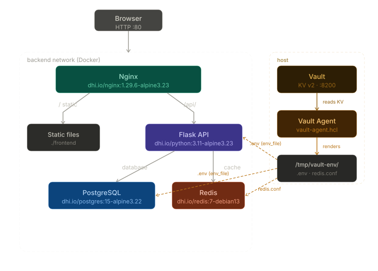

# Docker Hardening Migration
 
## App Architecture
 

 
## Image Choices
 
All four images were pulled from `dhi.io`. Using my own Docker Cloud account as it is free.
 
| Service  | Before         | After                                         |
| -------- | -------------- | --------------------------------------------- |
| API      | `python:3.11`  | `dhi.io/python:3.11-alpine3.23` (multi-stage) |
| Database | `postgres:15`  | `dhi.io/postgres:15-alpine3.22`               |
| Cache    | `redis:7`      | `dhi.io/redis:7-debian13`                     |
| Proxy    | `nginx:latest` | `dhi.io/nginx:1.29.6-alpine3.23`              |
 
I tried to use only non-root images, without shells or package managers, with the minimal vuln as possible.
 
#### Python
 
Python dev image:

Accessible here: [Python dev image list on dhi.io](https://hub.docker.com/hardened-images/catalog/dhi/python/images?search=3.11&distributions=alpine+3.23&variants=dev)
 
Python runtime image:

Accessible here: [Python runtime image list on dhi.io](https://hub.docker.com/hardened-images/catalog/dhi/python/images?search=3.11&distributions=alpine+3.23&variants=runtime)
 
#### Postgres
 

Accessible here: [Postgres image list on dhi.io](https://hub.docker.com/hardened-images/catalog/dhi/postgres/images?search=15)
 
#### Redis
 

Accessible here: [Redis image list on dhi.io](https://hub.docker.com/hardened-images/catalog/dhi/redis/images?page=0)
 
#### Nginx
 

Accessible here: [Nginx image list on dhi.io](https://hub.docker.com/hardened-images/catalog/dhi/nginx/images?distributions=alpine+3.23)
 
### Why Docker Hardened Images? Instead of Chainguard images for example.
 
- **Zero known CVEs** at publish time — Docker continuously patches and republishes.
- **Distroless runtime** — no shell, no package manager, minimal binaries.
- **Non-root by default** — all DHI images run as an unprivileged user out of the box.
- **Supply-chain transparency** — every image ships with a signed SBOM, SLSA Build Level 3 provenance, and VEX metadata.
- **Drop-in compatible** — same env vars and entrypoints as upstream Docker Official Images.
- **Apache 2.0 licensed** — no vendor lock-in, no hidden restrictions.
 
### Image variant notes
 
- **Postgres / Nginx / Python**: Alpine variants chosen for smallest footprint.
- **Redis**: DHI only offers Debian 13 for Redis — no Alpine variant exists. At ~64 MB it remains significantly smaller than the original `redis:7` (~117 MB).
 
---
 
## Dockerfile Changes (API)
 
#### Multi-stage build using Alpine:
 
```
Stage 1 (builder): dhi.io/python:3.11-alpine3.23-dev
  → has pip; installs deps into /install with --target
  → requirements.txt copied first for better layer caching
 
Stage 2 (runtime): dhi.io/python:3.11-alpine3.23
  → distroless; receives /app/lib and app.py only
  → PYTHONPATH=/app/lib set so Python finds packages
  → no USER directive needed — DHI runs as non-root by default
```
 
***Nota***:
Had to use `--target` instead of `--prefix` and copy packages to `/app/lib` with `PYTHONPATH` set accordingly, as Alpine Python was not looking at the right place with the previous structure.
 
#### Concerns:
 
| Concern | Before | After |
|---------|--------|-------|
| Base image | `python:3.11` (full Debian) | DHI distroless Python Alpine |
| Shell in runtime | Yes | No |
| pip in runtime | Yes | No |
| Runs as root | Yes | No |
| CVEs in base | High (200+) | ~0 |
 
***Nota***:
For the estimated CVEs, I scanned the images using Docker Scout (e.g., `docker scout cves python:3.11`)
 
---
 
## docker-compose Changes
 
| Change | Detail |
|--------|--------|
| All image tags | Replaced with DHI equivalents from `dhi.io`, pinned by digest for reproducibility |
| Network segmentation | `frontend` network (nginx↔host) and internal `backend` network (api↔db↔redis) — temporarily removed during Vault database engine setup, then restored |
| Postgres volume mount | Changed from `/var/lib/postgresql/data` to `/var/lib/postgresql` — DHI uses a versioned subdir (`/var/lib/postgresql/15/data`) so the parent must be mounted |
| Redis security | Redis started via `redis-server /etc/redis/redis.conf` with password injected by Vault Agent into a rendered `redis.conf` |
| Redis healthcheck | Added `-a ${REDIS_PASSWORD}` to `redis-cli ping` so the healthcheck itself authenticates |
| Secrets management | All credentials sourced from Vault Agent rendered files in `/tmp/vault-env/` — never stored on disk or in the repository |
| Read-only filesystems | All services use `read_only: true` with `tmpfs` for directories needing writes |
| Capabilities | `cap_drop: ALL` on all services; only specific caps re-added where strictly needed (`SETUID`/`SETGID`/`DAC_OVERRIDE` for postgres init, `NET_BIND_SERVICE` for nginx port 80) |
| No new privileges | `no-new-privileges:true` set on all services |
| Resource limits | CPU and memory limits defined for all services via `deploy.resources` |
| Health check tuning | Added `start_period` to all healthchecks to avoid false failures during init |
| API image name | Added `image: dhi-taskapi:latest` so the built image is named and tagged |
 
## app.py Changes
 
Added `REDIS_PASSWORD` env var reading and passed it to the Redis client constructor:
 
```python
redis_password = os.getenv('REDIS_PASSWORD', None)
cache = redis.Redis(
    host=redis_host,
    port=redis_port,
    password=redis_password,  # added
    ...
)
```
 
---
 
## Size Comparison (approximate)
 
| Service | Before | After | Reduction |
|---------|--------|-------|-----------|
| API | ~1.15 GB | ~106 MB | ~91% |
| postgres | ~445 MB | ~289 MB | ~35% |
| redis | ~117 MB | ~64 MB | ~45% |
| nginx | ~161 MB | ~11 MB | ~93% |
| **Total** | **~1.87 GB** | **~470 MB** | **~75%** |
 
***Nota***:
Ran `docker images` after build to confirm the sizes.
 
---
 
## Security Improvements Summary
 
1. No shell in any runtime container → prevents interactive exploitation post-RCE (Remote Code Execution).
2. No root processes across all four services → limits blast radius of any escape.
3. No package managers at runtime → prevents in-container software installation.
4. Redis password authentication enabled → removes unauthenticated access vector.
5. Signed SBOMs + SLSA L3 provenance → full supply-chain auditability.
6. Unpinned `nginx:latest` eliminated → deterministic, security-patched builds.
7. All images pinned by digest → fully reproducible builds, immune to tag mutation.
8. Read-only filesystems on all containers → prevents runtime filesystem tampering.
9. All Linux capabilities dropped → minimal privilege surface per container.
10. Network segmentation → backend services unreachable from the host directly.
11. Secrets managed by HashiCorp Vault → no plaintext credentials in compose files, environment, or shell history.
 
---
 
## Secrets Management (HashiCorp Vault)
 
Credentials are managed by an external HashiCorp Vault instance and never stored in the repository or on disk.
 
### Architecture
 
```
Vault (external, http://local.vault.starfly.fr:8200)
  │
  └─ Vault Agent (running on host)
        │  authenticates via token file at /tmp/vault-agent-token
        │  reads KV v2 secrets every 5 minutes
        │  renders files to /tmp/vault-env/ (RAM-backed on macOS, never written to disk)
        │
        ├─ /tmp/vault-env/.env       → sourced into shell before docker compose up
        └─ /tmp/vault-env/redis.conf → mounted into redis container (requirepass <password>)
```
 
### Vault KV Secret Paths
 
| Path | Keys |
|------|------|
| `docker-dhi-setup/data/postgres` | `username`, `password`, `db` |
| `docker-dhi-setup/data/redis` | `password` |
 
### vault-agent.hcl
 
Two templates are rendered on startup and re-rendered every 5 minutes if secrets change:
 
- **`.env`** — contains `POSTGRES_USER`, `POSTGRES_PASSWORD`, `POSTGRES_DB`, `REDIS_PASSWORD`; sourced into the shell before `docker compose up` so compose can interpolate `${VAR}` normally
- **`redis.conf`** — contains `requirepass <password>` baked in directly; mounted into the redis container at `/etc/redis/redis.conf` to avoid compose variable interpolation issues with the `command` block
 
### Startup Sequence
 
```sh
# 1. Write Vault token to RAM
echo $VAULT_TOKEN > /tmp/vault-agent-token && chmod 600 /tmp/vault-agent-token
 
# 2. Start Vault Agent
mkdir -p /tmp/vault-env
vault agent -config=vault-agent.hcl &
 
# 3. Wait for secrets to be rendered
until [ -s /tmp/vault-env/.env ] && [ -s /tmp/vault-env/redis.conf ]; do
  sleep 1
done
 
# 4. Source .env into shell for compose variable interpolation
set -a && source /tmp/vault-env/.env && set +a
 
# 5. Start containers
docker compose up -d
```
 
### Why /tmp on macOS
 
On macOS, `/tmp` is backed by an APFS in-memory volume — it is never written to a spinning disk or SSD and is cleared on reboot. Docker Desktop shares `/tmp` with its Linux VM by default, making it usable as both a Vault Agent render destination and a compose `env_file` source without any additional configuration.
 
***Nota***:
`env_file` values are injected into container environments at start time only — they are not watched for changes at runtime. If Vault Agent re-renders `/tmp/vault-env/.env` due to a secret rotation, the affected containers (`db`, `redis`) must be restarted to pick up the new values. This is expected behaviour: both postgres and redis require a restart to apply credential changes regardless of how they are delivered.
 
---
 
## nginx.conf Changes
 
The DHI nginx image runs as a non-root user and cannot write to `/run`. All writable paths were redirected to `/tmp`, which is mounted as a `tmpfs` in the container:
 
```nginx
pid /tmp/nginx.pid;
 
http {
    client_body_temp_path  /tmp/client_temp;
    proxy_temp_path        /tmp/proxy_temp;
    fastcgi_temp_path      /tmp/fastcgi_temp;
    uwsgi_temp_path        /tmp/uwsgi_temp;
    scgi_temp_path         /tmp/scgi_temp;
}
```
 
---
 
## Possible Security Improvements
 
**Dynamic PostgreSQL secrets** — use Vault's database secrets engine to issue short-lived, auto-revoked PostgreSQL credentials per application instance instead of static KV credentials. `vault-setup.sh` and `hvac==2.4.0` in `requirements.txt` are already prepared for this.
 
**AppRole authentication** — replace token-based Vault Agent auth with AppRole for better secret-zero handling in production environments.
 
**HTTPS / TLS termination** — add TLS via Let's Encrypt or Traefik or in the app.