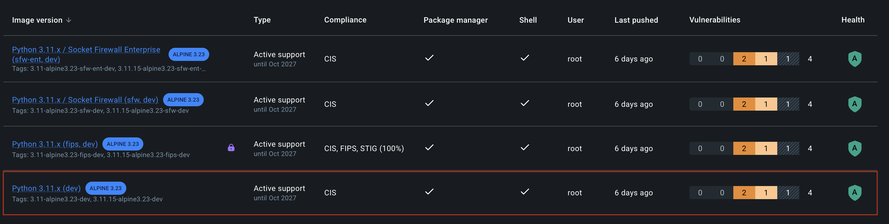
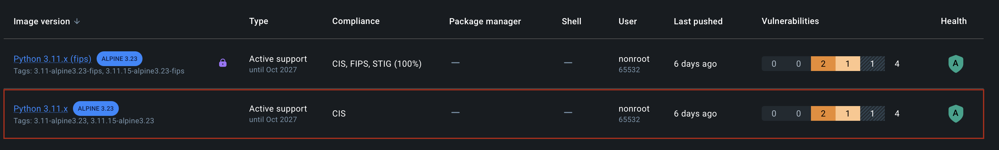
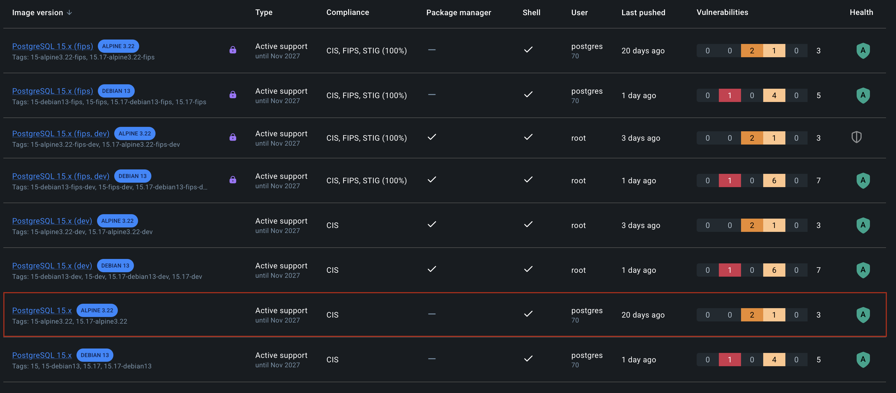
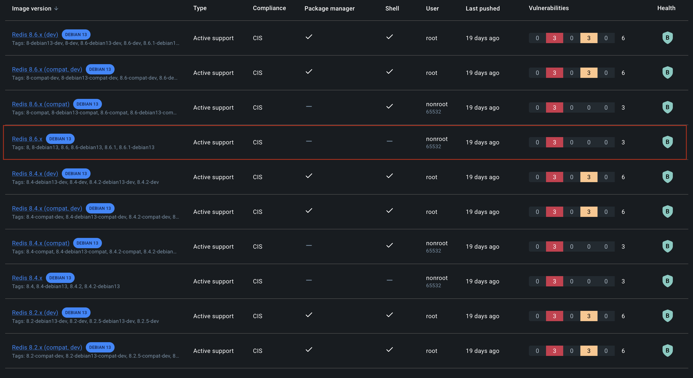
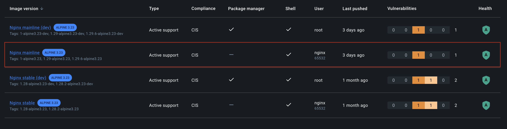

# Docker Hardening Migration

## Image Choices

All four images were pulled from `dhi.io`. Using my own Docker Cloud account as it is free.

| Service  | Before         | After                                         |
| -------- | -------------- | --------------------------------------------- |
| API      | `python:3.11`  | `dhi.io/python:3.11-alpine3.23` (multi-stage) |
| Database | `postgres:15`  | `dhi.io/postgres:15-alpine3.22`               |
| Cache    | `redis:7`      | `dhi.io/redis:8-debian13`                     |
| Proxy    | `nginx:latest` | `dhi.io/nginx:1.29.6-alpine3.23`              |

I tried to use only non-root images, without shells or package managers, with the minimal vuln as possible.
#### Python

Python dev image:


Python runtime image:


#### Postgres



#### Redis



#### Nginx



### Why Docker Hardened Images?

- **Zero known CVEs** at publish time — Docker continuously patches and republishes.
- **Distroless runtime** — no shell, no package manager, minimal binaries.
- **Non-root by default** — all DHI images run as an unprivileged user out of the box.
- **Supply-chain transparency** — every image ships with a signed SBOM, SLSA Build Level 3 provenance, and VEX metadata.
- **Drop-in compatible** — same env vars and entrypoints as upstream Docker Official Images.
- **Apache 2.0 licensed** — no vendor lock-in, no hidden restrictions.

### Image variant notes

- **Postgres / Nginx / Python**: Alpine variants chosen for smallest footprint.
- **Redis**: DHI only offers Debian 13 for Redis — no Alpine variant exists. At ~32 MB it remains significantly smaller than the original `redis:7` (~130 MB). Redis was also bumped from 7 to 8, which is the only version available in DHI and is backwards compatible for caching use cases.

---

## Dockerfile Changes (API)

Multi-stage build using Alpine:

```
Stage 1 (builder): dhi.io/python:3.11-alpine3.23-dev
  → has pip; installs deps into /install with --target

Stage 2 (runtime): dhi.io/python:3.11-alpine3.23
  → distroless; receives /app/lib and app.py only
  → PYTHONPATH=/app/lib set so Python finds packages
```

| Concern | Before | After |
|---------|--------|-------|
| Base image | `python:3.11` (full Debian) | DHI distroless Python Alpine |
| Shell in runtime | Yes | No |
| pip in runtime | Yes | No |
| Runs as root | Yes | No |
| CVEs in base | High (50+) | ~0 |

---

## docker-compose Changes

| Change | Detail |
|--------|--------|
| All image tags | Replaced with DHI equivalents from `dhi.io` |
| Postgres volume mount | Changed from `/var/lib/postgresql/data` to `/var/lib/postgresql` — DHI uses a versioned subdir (`/var/lib/postgresql/15/data`) so the parent must be mounted |
| Redis command | Added `--requirepass ${REDIS_PASSWORD:-changeme}` — DHI Redis defaults to `protected-mode yes`, which blocks inter-container traffic without a password |
| Redis healthcheck | Added `-a ${REDIS_PASSWORD:-changeme}` to `redis-cli ping` so the healthcheck itself authenticates |
| Redis password in API env | Added `REDIS_PASSWORD` env var so the Flask app can authenticate |
| Nginx tag | Replaced unpinned `nginx:latest` with `dhi.io/nginx:1.29.6-alpine3.23` |

## app.py Changes

Added `REDIS_PASSWORD` env var reading and passed it to the Redis client constructor:

```python
redis_password = os.getenv('REDIS_PASSWORD', None)
cache = redis.Redis(
    host=redis_host,
    port=redis_port,
    password=redis_password,  # added
    ...
)
```

---

## Size Comparison (approximate)

| Service | Before | After | Reduction |
|---------|--------|-------|-----------|
| API | ~1.0 GB | ~80 MB | ~92% |
| postgres | ~560 MB | ~90 MB | ~84% |
| redis | ~130 MB | ~32 MB | ~75% |
| nginx | ~190 MB | ~20 MB | ~89% |
| **Total** | **~1.88 GB** | **~222 MB** | **~88%** |

> Run `docker images` after build to confirm exact sizes on your platform.

---

## Security Improvements Summary

1. No shell in any runtime container → prevents interactive exploitation post-RCE.
2. No root processes across all four services → limits blast radius of any escape.
3. No package managers at runtime → prevents in-container software installation.
4. Redis password authentication enabled → removes unauthenticated access vector.
5. Signed SBOMs + SLSA L3 provenance → full supply-chain auditability.
6. Unpinned `nginx:latest` eliminated → deterministic, security-patched builds.

---

## Suggested Further Improvements

**Secrets management** — replace plaintext env var defaults with Docker secrets or a vault.

**Read-only filesystems:**
```yaml
services:
  api:
    read_only: true
    tmpfs:
      - /tmp
```

**Drop Linux capabilities:**
```yaml
    security_opt:
      - no-new-privileges:true
    cap_drop:
      - ALL
```

**Network segmentation** — separate `frontend` network for nginx↔host, keeping `backend` internal for api↔db↔redis.

**Image pinning by digest** for fully reproducible builds:
```yaml
image: dhi.io/postgres:15-alpine3.22@sha256:<digest>
```

**Resource limits** — add `deploy.resources.limits` to prevent resource exhaustion.

**HTTPS / TLS termination** — add TLS via Let's Encrypt or Traefik.